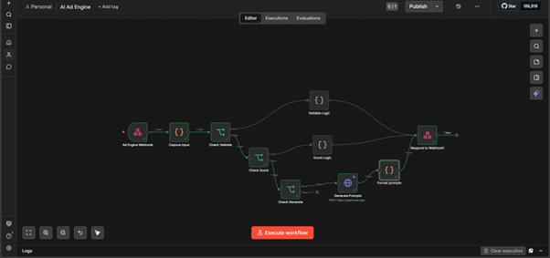
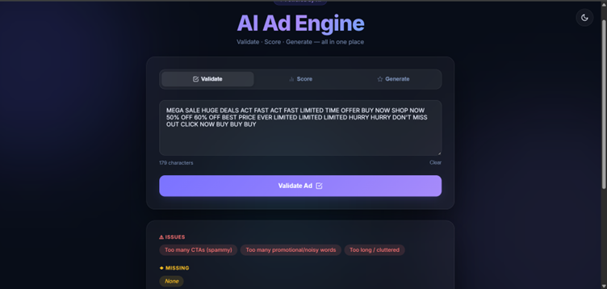
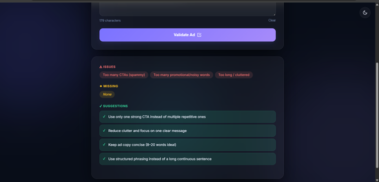
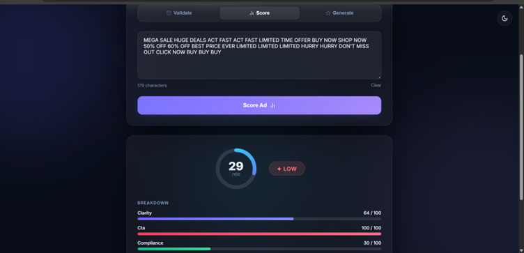
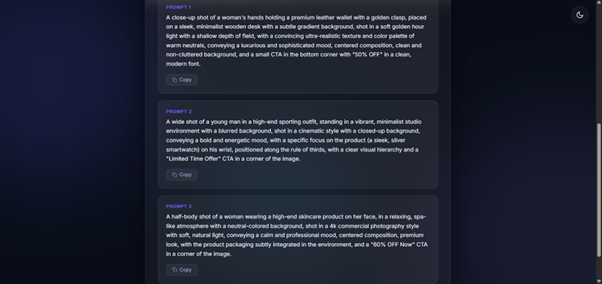

# AI Ad Engine

AI Ad Engine is an intelligent advertisement analysis and creative generation platform designed to evaluate marketing content, identify improvement opportunities, score advertisement quality, and generate professional creative concepts for digital campaigns.

---

## Overview

Creating effective advertisements requires a balance of clarity, engagement, messaging quality, and conversion-focused content. This project automates the advertisement review process by analyzing ad copy, detecting weaknesses, calculating quality metrics, and generating creative directions for marketing campaigns.

The workflow helps marketers, creators, and businesses improve advertisement performance while reducing manual review effort.

---

## Key Features

- Advertisement content validation
- Content quality assessment
- Call-to-action evaluation
- Repetition detection
- Advertisement scoring system
- Content improvement recommendations
- Creative concept generation
- Automated marketing workflow

---

## Workflow Design

The workflow processes advertisement content through multiple automated stages:

1. Advertisement input collection
2. Content validation
3. Quality assessment
4. Score calculation
5. Recommendation generation
6. Creative prompt generation

### Workflow Architecture

---

## Advertisement Validation

The validation engine evaluates advertisement quality and identifies areas that may impact campaign effectiveness.

Validation checks include:

- Content clarity
- Message quality
- Content repetition
- Advertisement structure
- Call-to-action presence
- Promotional language balance

### Validation Results

### Detailed Validation Analysis

---

## Advertisement Scoring

The scoring engine analyzes advertisement quality and generates performance metrics that help assess content effectiveness.

The system evaluates:

- Content clarity
- Message structure
- CTA effectiveness
- Advertisement quality
- Content consistency

### Score Analysis

---

## Creative Prompt Generation

After evaluating the advertisement, the workflow generates structured creative concepts that can be used for marketing asset creation and campaign development.

Generated concepts focus on:

- Visual direction
- Marketing themes
- Advertisement composition
- Creative presentation
- Campaign consistency

### Generated Creative Concepts

---

## Benefits

### Faster Content Review

Reduces the time required to manually evaluate advertisement quality.

### Improved Advertisement Quality

Identifies potential weaknesses before campaign deployment.

### Consistent Evaluation

Provides standardized analysis across different advertisement types.

### Creative Assistance

Generates marketing-oriented creative concepts automatically.

### Scalable Workflow

Supports repeated advertisement evaluation without additional manual effort.

---

## Technology Stack

- n8n Workflow Automation
- JavaScript
- AI Language Models
- REST APIs
- Prompt Engineering
- Automated Validation Systems

---

## Use Cases

- Marketing Campaign Review
- Advertisement Optimization
- Creative Concept Development
- Content Quality Assessment
- Social Media Campaign Planning
- Digital Marketing Automation

---

## Project Highlights

- Designed an end-to-end advertisement analysis workflow
- Built automated validation and assessment processes
- Implemented structured advertisement scoring
- Automated recommendation generation
- Created AI-assisted creative concept generation pipeline
- Improved consistency in advertisement evaluation

---

## Future Enhancements

- Multi-platform advertisement optimization
- Campaign performance prediction
- A/B testing recommendations
- Multi-language advertisement analysis
- Advanced content analytics
- Marketing dashboard integration

---

## Author

Developed as an automation and AI workflow project focused on intelligent advertisement analysis, content optimization, and creative automation.
